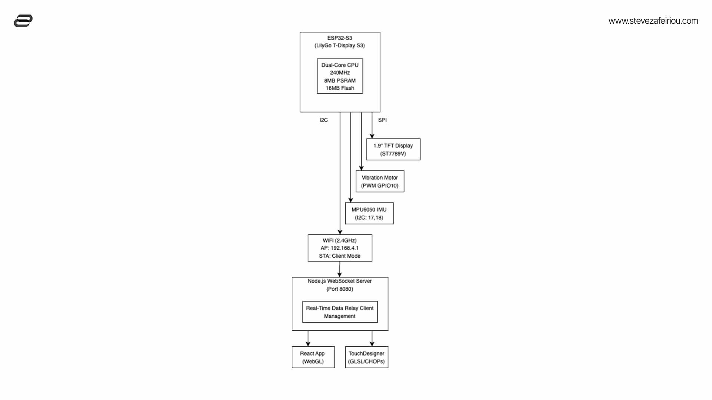

# SensorDataTD: Real-Time Sensor Data Transfer System

The **SensorDataTD** project is a complete solution for real-time accelerometer data collection, processing, and transmission. It includes both hardware and software components, along with a 3D-printable case design.

You can find the complete tutorial at this link: [Sensor Data to TouchDesigner](#) _(Link to be added)_.

## Project Overview

This project comprises three main components:

1. **ESP32 Firmware**: Collects sensor data from an MPU6050 accelerometer, processes it, and transmits it via WebSocket.
2. **Server**: A Node.js WebSocket server to handle incoming sensor data and broadcast it to connected clients.
3. **3D-Printed Case**: A custom enclosure for the LilyGo T-Display S3 and MPU6050 hardware.

## Folder Structure

- **`SensorDataTD/`**
  - **`SensorDataTD/`**: Contains the ESP32 firmware and related code.
    - [Read the ESP32 Firmware Documentation](./SensorDataTD/README.md)
  - **`models/`**: Contains `.stl` files and 3D-printing instructions for the project case.
  - **`server/`**: Contains the WebSocket server code in Node.js.
    - [Read the Server Documentation](./server/README.md)
  - **`lilygo-t-display/`**: Contains Squareline Studio files for GUI design (ignored in Git).

## Project Setup

### 1. Hardware Setup

#### Components Required:

- **LilyGo T-Display S3**
  - **Integrated TFT Display**: No additional configuration is needed.
- **MPU6050 Accelerometer Module**
- **Vibration Motor**
- Jumper wires and breadboard or custom PCB
- Power supply (e.g., USB cable or LiPo battery)

#### Wiring Diagram:



| LilyGo T-Display Pin | MPU6050 Pin | Vibration Motor Pin     |
| -------------------- | ----------- | ----------------------- |
| `3V3`                | `VCC`       | Positive terminal       |
| `GND`                | `GND`       | Negative terminal       |
| `GPIO18`             | `SCL`       |                         |
| `GPIO17`             | `SDA`       |                         |
| `GPIO10`             |             | Motor Positive Terminal |

**Note**: The TFT display is integrated into the LilyGo T-Display S3 board and requires no additional wiring or configuration.

### 2. ESP32 Firmware

1. **Set Up the Arduino IDE**:

   - Follow this guide to set up the LilyGo T-Display S3 in the Arduino IDE:  
     [LilyGo T-Display S3 - Setup Guide](https://stevezafeiriou.com/lilygo-t-display-s3-setup/)

   - Install the Required Libraries:
     - `TFT_eSPI` (pre-configured for the T-Display)
     - `WebSocketsClient`
     - `Preferences`
     - `Adafruit_MPU6050`

2. **Upload the Firmware**:

   - Open the `SensorDataTD/SensorDataTD.ino` file in Arduino IDE.
   - Select the **LilyGo T-Display S3** board under `Tools -> Board`.
   - Upload the firmware to the board.

3. **WiFi Configuration**:
   - On first boot, connect to the `SensorDataTD` WiFi network.
   - Navigate to `192.168.4.1` in your browser to configure WiFi and server IP.

[Read the ESP32 Firmware Documentation](./SensorDataTD/README.md)

### 3. Server Setup

1. **Install Node.js**:

   - Download and install Node.js from [https://nodejs.org/](https://nodejs.org/).

2. **Set Up the Server**:
   - Navigate to the `server/` directory:
     ```bash
     cd server
     ```
   - Install dependencies:
     ```bash
     npm install
     ```
   - Run the server:
     ```bash
     node server.js
     ```
   - The server will start on port `8080` and display your local IP addresses. Use one of these addresses to configure the ESP32 WebSocket connection.

[Read the Server Documentation](./server/README.md)

### 4. 3D-Printed Case

1. **Print the Case**:

   - Use the `.stl` files in the `models/` folder to print the enclosure.
   - Recommended settings:
     - Material: PLA or PETG
     - Layer Height: 0.2mm
     - Infill: 20%-30%

2. **Assemble the Hardware**:
   - Place the LilyGo T-Display S3, MPU6050, and vibration motor into the case.
   - Use screws or adhesive as needed to secure the components.

## Usage

1. **Start the ESP32**:

   - Power on the LilyGo T-Display S3. It will connect to WiFi and start transmitting sensor data to the WebSocket server.

2. **Start the Server**:

   - Ensure the server is running and the LilyGo T-Display S3 is configured with the correct WebSocket server IP.

3. **Monitor the Data**:
   - Connect a WebSocket client to the server (e.g., `ws://<server_ip>:8080`) to view the real-time sensor data.

## Troubleshooting

1. **WiFi Issues**:

   - Check the SSID and password in the WiFi configuration portal.
   - Ensure the target network is available and within range.

2. **Server Not Receiving Data**:

   - Verify the LilyGo T-Display S3 is configured with the correct server IP.
   - Check that the Node.js server is running and listening on port 8080.

3. **Accelerometer Data Issues**:

   - Ensure the MPU6050 is connected to the correct pins (`SCL -> GPIO18`, `SDA -> GPIO17`).
   - Verify that the MPU6050 module is powered.

4. **Vibration Motor Not Working**:
   - Check the wiring for the motor (`Input -> GPIO10`).
   - Verify that the vibration threshold is configured appropriately in the firmware.

## License

This project is licensed under the MIT License. See the [LICENSE](LICENSE) file for details.

## Contributions

Contributions are welcome! Feel free to submit issues, feature requests, or pull requests.

## Contact

For questions or support, please contact [steve@saphirelabs.com](mailto:steve@saphirelabs.com).
